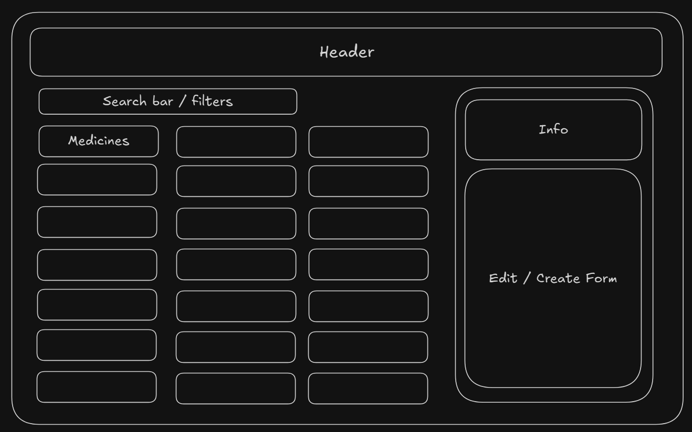
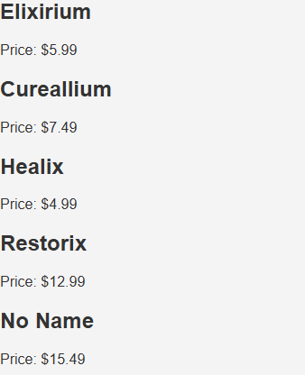
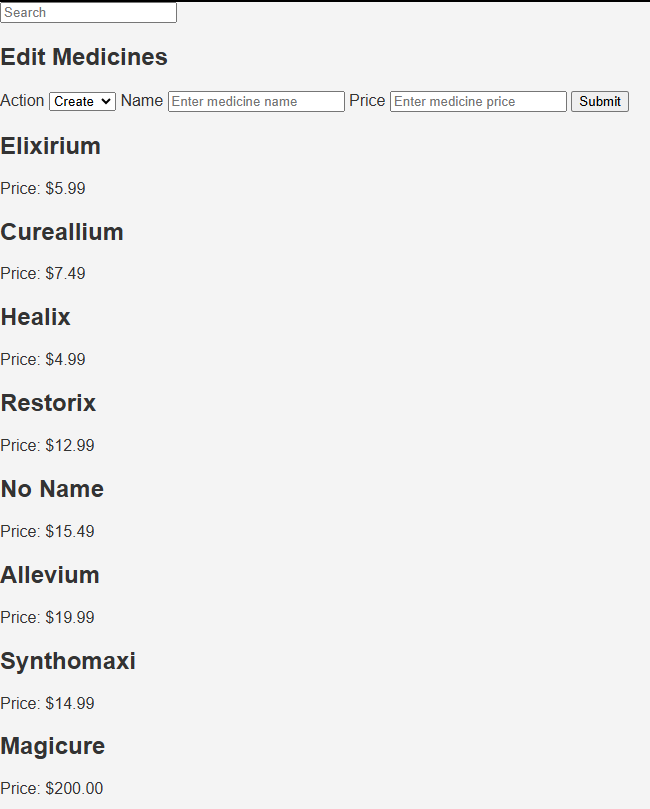
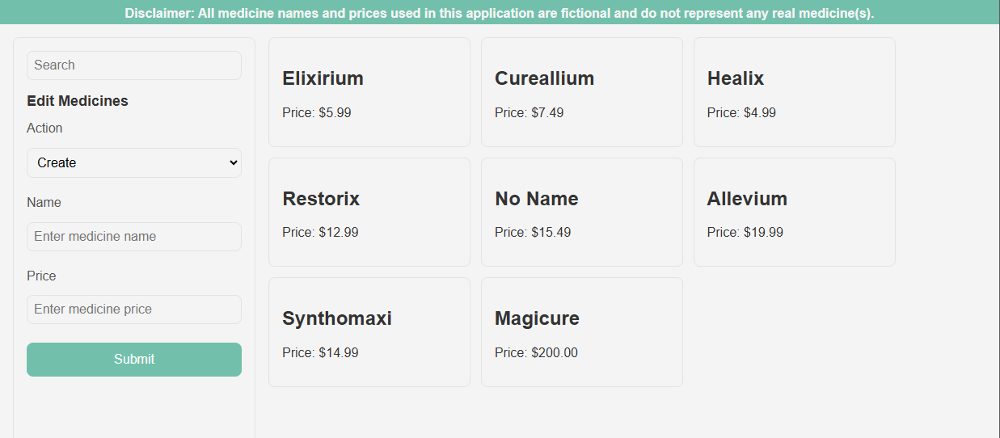

# Lilly Technical Challenge Documentation Template

***Not every section in this document is required. This is just a template to help get you started. Feel free to add or remove sections as you feel necessary.***

## Approach
*How did you approach this challenge? Did you work through the objectives in any particular order? If so, why? Did you utilize any external resources, such as tutorials, guides, or other materials?*

### Initial Thoughts

First I outlined what the objectives are and how they translate into requirements / what my thoughts are for as to how I might implement the required features.

  - Fetch data from backend through API
  - Display data in readable way
  - Handle null/undefined data (probably through conditional rendering)
  - Form for creating new medicine
  - Implement improved UI
  - Function for average price of all medicines

**UI:**

My initial thoughts for the user interface was A layout like this:



This helped me understand what UI features will be needed and thus what data / state these features need. Which helped inform how I developed frontend.

**Development Approach:**

My approach for developing this web app was to use the practices I was familiar with from using frameworks like React / Next. I seperated the file structure out in a way which made it clearer to understand what different parts of the code base are used for.

This looked like:
```
.
└── frontend/
    ├── components
    ├── lib/
    │   ├── utils.js
    │   └── types.js
    ├── script.js
    ├── styles.css
    └── index.html
```

I also want to include some level of typesaftey (as much as possible in vanilla js), assuming that we can't use TypeScript. I am going to make use of [JS Doc](https://jsdoc.app/) type defs in order to accomplish this.

### Development

**API Utils:** 

The first task I decided to do in the development was create the API util functions that I would use to interface with the FastAPI. This is essentially what I implemented for each API route:

```js
/**
 * Fetches all medicines from the backend.
 * @returns {Promise<Medicine[]>}
 */
export async function getAllMedicines() {
  const response = await fetch(`${BASE_URL}/medicines`, {
    method: "GET",
  });
  if (response.ok) {
    const data = await response.json();
    return data["medicines"];
  }
}
```

Pretty simple.

**Displaying Data**:

In order to display that data I first had to create the layout of the page in the `index.html`, which looked like this:

```html
<body>
    <div id="disclaimer" class="disclaimer">
        Disclaimer: All medicine names and prices used in this application are fictional and do not
        represent any real medicine(s).
    </div>
    <main>
        <aside id="sidebar" class="sidebar">
            <div id="search" class="search-container"></div>
            <div id="form" class="form-container"></div>
            <div id="info" class="info-container"></div>
        </aside>
        <div id="medicines" class="medicines"></div>
    </main>
    <script type="module" src="script.js"></script>
</body>
```

The first aspect of data which I could display was the list of all medicines. This was accomplished by fetching all the medicines and through the list to map each medicine to a `medicine-card` component. Like this:

```js
const root = document.getElementById("medicines");
root.innerHTML = "Loading...";

try {
  const medicines = await getAllMedicines();
  root.innerHTML = "";

  medicines.forEach((medicine) => {
    const card = createMedicineCard(medicine);
    if (card) root.appendChild(card);
  });

} catch (error) {
  root.innerHTML = "Failed to load medicines.";
  console.error(error);
}
```

With the output being this:



This same methodology of using components and mapping them to the DOM can be used to implement the following features as well:

- The search bar
- The create/update form
- And the info section

When implemented I had this:




The functionality for searching was pretty simple to implement. All I had to do was move the `medicines` array fetched from the API into the global scope so that I could filter through it when the value of the input changes.

```js
const filteredMedicines = medicines.filter(medicine =>
  medicine.name.toLowerCase().includes(value.toLowerCase())
);
```

The form works by checking what action was selected to decided what API util function to pass the form data into in order to peform the mutation on the backend.

```js
if (action === "create") {
  const response = await createMedicine(formData);
} else {
  const response = await updateMedicine(formData);
}
```

**Styling:**

A big improvement that can be made now is on the styles. My idea of the layout has changed a little from the start, now I am going to place the sidebar on the left instead. 

After applying some simple styles, making use of CSS variables, I had this:



As of now the UI is not completely responsive.

**Average Function:**

In order to implement the info component I will first have to implement the `average` API route. 

This was simple to implement. The function simply iterates through the medicines array to record the total price of all medicines (acounting for null values).

```python
with open('data.json', 'r') as meds:
    current_db = json.load(meds)
    medicines = current_db["medicines"]
    total = 0
    num_meds = len(medicines)
    for med in medicines:
        price = med["price"]

        if isinstance(price, (int, float)) and price != None:
            total += price
        else:
            num_meds -= 1

    
    if num_meds <= 0:
        return { "error" : "No valid average available."}
    
    return { "average" : total / num_meds}
```

**Finishing UI:**

Now that I have implemented the avearge API route I can create the info component which simply displays the average medicine price:


## Objectives - Innovative Solutions
*For the challenge objectives, did you do anything in a particular way that you want to discuss? Is there anything you're particularly proud of that you want to highlight? Did you attempt some objectives multiple times, or go back and re-write particular sections of code? If so, why? Use this space to document any key points you'd like to tell us about.*

## Problems Faced
*Use this space to document and discuss any issues you faced while undertaking this challenge and how you solved them. We recommend doing this proactively as you experience and resolve the issues - make sure you don't forget! (Screenshots are helpful, though not required)*.

## Evaluation
*How did you feel about the challenge overall? Did some parts go better than others? Did you run out of time? If you were to do this again, and were given more time, what would you do differently?*